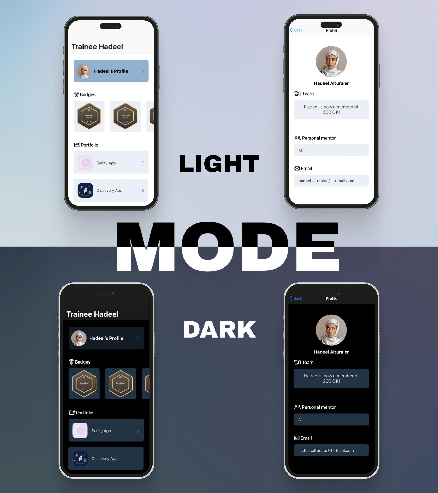
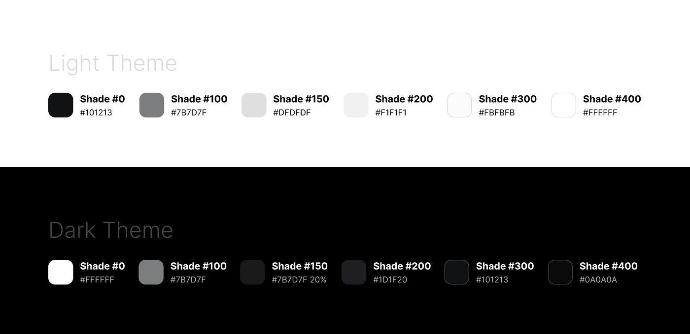
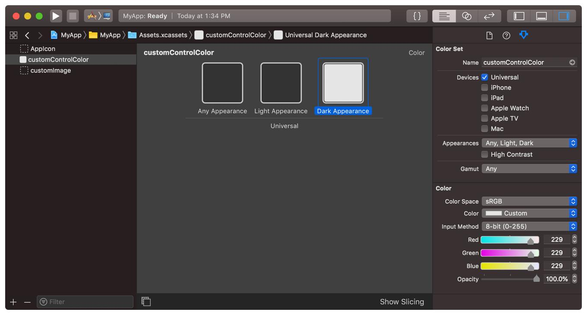
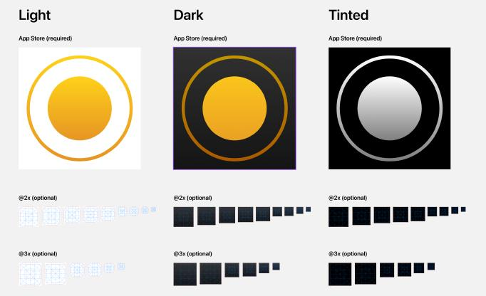
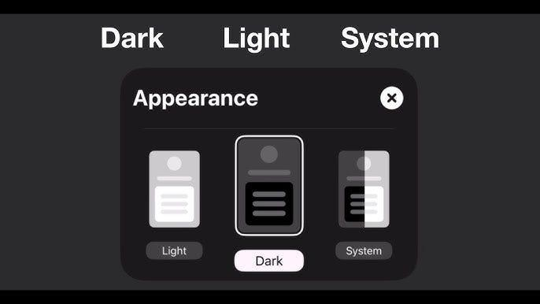

# 🌙 Mastering Dark Mode and Dynamic Colors in iOS Development  
## Build Beautiful, Adaptive, Production-Ready UI

---

## 🌌 Introduction



Ever opened an app at night and felt like your eyes were being attacked by brightness?

Dark Mode is not just a feature — it’s a **UX necessity**.

---

## 🧠 Dynamic UI > Static Colors

❌ Wrong approach:

```swift
UIColor.white
UIColor.black
````

---

✅ Correct approach:

```swift
view.backgroundColor = .systemBackground
label.textColor = .label
```

---

## 🎨 How Dynamic Colors Work



Dynamic colors adapt using:

* UITraitCollection
* userInterfaceStyle
* System color mapping

---

## ⚠️ Common Mistake

```swift
Color.white
Color.black
```

❌ Breaks in Dark Mode

---

## 🏗️ Asset Catalog (Best Practice)



Steps:

1. Assets.xcassets
2. Create Color Set
3. Enable Any, Dark
4. Add variants

---

## 🧪 Programmatic Colors

```swift
let dynamicColor = UIColor { trait in
    trait.userInterfaceStyle == .dark ? .black : .white
}
```

---

## 🔄 Detect Theme Changes

### UIKit

```swift
override func traitCollectionDidChange(_ previousTraitCollection: UITraitCollection?) {
    if traitCollection.hasDifferentColorAppearance(comparedTo: previousTraitCollection) {
        print("Theme changed")
    }
}
```

---

### SwiftUI

```swift
@Environment(\.colorScheme) var colorScheme
```

---

## 🖼️ Images & Icons



```swift
imageView.tintColor = .label
imageView.image = image.withRenderingMode(.alwaysTemplate)
```

---

## 🎯 Design System

```swift
struct AppColors {
    static let background = Color("AppBackground")
    static let textPrimary = Color("TextPrimary")
}
```

---

## 🧪 Testing Dark Mode



* Simulator: Shift + Cmd + A
* SwiftUI Preview:

```swift
.preferredColorScheme(.dark)
```

---

## 🎉 Conclusion

Dark Mode is a **design philosophy**.

Build:

* Adaptive UI
* Scalable design system
* Accessible experience

---

**Made with ❤️ for iOS Labs**